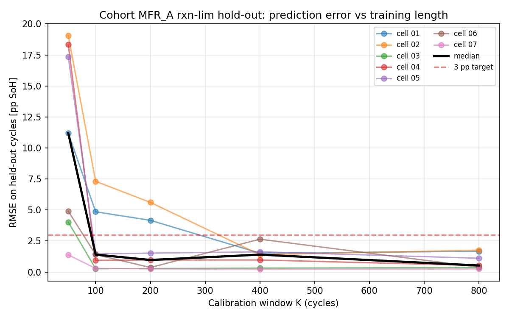

# PyBaMM Neural-ODE RUL

**Physics-guided remaining-useful-life prediction for second-life LFP cells.**

Companion code for the PyBaMM Conference 2026 abstract *"Physics-guided
characterisation-time reduction for second-life LFP cells: how few cycles
does PyBaMM's reaction-limited SEI need?"* ([`paper/pybamm_conf_abstract.pdf`](paper/pybamm_conf_abstract.pdf)).

Cells are referenced by anonymised cohort labels (`MFR_A`, `MFR_B`, `MFR_C`)
and sequential per-cohort IDs (`01` … `07`).

## Headline result

For LFP cells within the reaction-limited SEI fade regime, PyBaMM's rxn-lim
SEI model calibrated on the first 400 measured cycles predicts the remaining
600–1000 cycles with RMSE < 3 pp SoH for all 7/7 tested cells (median 1.4 pp).
Five of seven cells already converge at K=100, giving end-of-trajectory error
below 0.4 pp. This is a 65–75% reduction in required cycling time compared to
full-trajectory calibration.



## Layout

```
.
├── pybamm_tuning/          # per-cell PyBaMM parameterisation + calibration
├── src/pinn/               # Neural-ODE surrogate for SoH dynamics
├── scripts/                # Reproducers for the abstract's figures
│   ├── mfr_a_clean_cells_rxnlim_sweep.py    # base full-trajectory sweep
│   ├── mfr_a_clean_cells_holdout_sweep.py   # abstract's hold-out experiment
│   └── holdout_trajectory_figure.py         # Figure 1b
├── outputs/holdout_sweep/  # Archived results from the abstract
│   ├── MFR_A_holdout_sweep_summary.csv      # per-(cell, K) fit + RMSE
│   ├── holdout_rmse_vs_K.png                # Figure 1a
│   └── fig2_trajectory_cell_07.png          # Figure 1b
└── paper/                  # Abstract source + compiled PDF
```

## Reproducing the result

```bash
python3 -m venv .venv
.venv/bin/python -m pip install -r requirements.txt
```

Scripts read the canonical cycling parquet at `data/canonical/mfr_a.parquet`.
This file is **not committed**. Expected schema:

| column         | dtype   | description                      |
|----------------|---------|----------------------------------|
| `cell_id`      | string  | zero-padded 4-digit cell number  |
| `global_cycle` | int64   | continuous cycle count           |
| `soh`          | float64 | state-of-health (0–1 range)      |

Per-cell characterisation is loaded via `pybamm_tuning.load_characterization`.

```bash
# Full sweep (7 cells × 5 K values) — ~30 min on 1 core
.venv/bin/python scripts/mfr_a_clean_cells_holdout_sweep.py

# Figure 1b (cell 07 trajectory overlay at K=100)
.venv/bin/python scripts/holdout_trajectory_figure.py
```

Outputs land in `outputs/holdout_sweep/`.

## Scope

- **Chemistry:** LFP (`Prada2013` parameter set)
- **Ambient:** 25 °C, isothermal
- **Fade regime:** reaction-limited SEI. Cells routed elsewhere by shape
  classification (non-monotonic-early, three-regime, LAM-dominated) are
  out of scope — see `pybamm_tuning/validation.py::classify_shape` and
  the abstract's *Scope* section.

## License

Pending. Code is provided as companion material to the PyBaMM Conference
2026 submission; commercial reuse requires prior written permission from
the author.

## Contact

Krishna Chaitanya Vaddepally · `krishna.vaddepally@turno.club`
